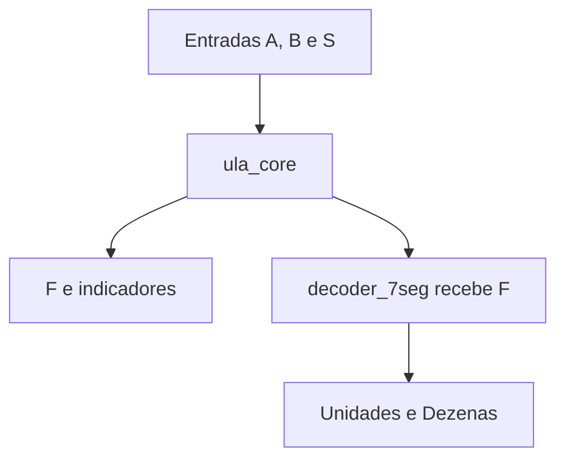

# ULA de 5 bits no Quartus

Projeto acadêmico de uma Unidade Lógica e Aritmética (ULA) combinacional para dois operandos de **5 bits com sinal**, com oito operações, indicadores de estado e decodificação para dois displays de sete segmentos.

Os circuitos são implementados em **diagramas de blocos/esquemáticos BDF**, com portas básicas **NOT, AND, OR e XOR**. A implementação do circuito não usa VHDL ou Verilog.

## Estrutura do projeto

| Arquivo | Função |
| --- | --- |
| `ULA_5bits/ula_projeto.qpf` | Projeto a abrir no Quartus |
| `ULA_5bits/ula_projeto.qsf` | Configurações, dispositivo e lista de fontes |
| `ULA_5bits/ula_projeto.bdf` | Nível superior: conecta a ULA core ao decodificador |
| `ULA_5bits/ula_core.bdf` | Aritmética, comparações, seleção e indicadores |
| `ULA_5bits/decoder_7seg.bdf` | Conversão do resultado para dois displays |
| `ULA_5bits/teste_rapido.vwf` | Teste editável no estado enviado após os testes manuais |
| `ULA_5bits/teste_rapido_original.vwf` | Cópia dos 24 cenários originais, com duração total de 2,4 µs |
| `ULA_5bits/teste_exaustivo.vwf` | 8.192 combinações, com duração total de 819,2 µs |
| `ULA_5bits/resultados_esperados.csv` | Resultados de referência para as 8.192 combinações |
| `ULA_5bits/LEIA_PRIMEIRO.txt` | Instruções originais e convenções da implementação |
| `ULA_5bits/verificacao.txt` | Registro da verificação lógica feita na geração |


## Entradas e saídas

| Sinal | Largura | Significado |
| --- | --- | --- |
| `A[4..0]` | 5 bits | Primeiro operando, de −16 a 15 |
| `B[4..0]` | 5 bits | Segundo operando, de −16 a 15 |
| `S[2..0]` | 3 bits | Seleção da operação |
| `F[4..0]` | 5 bits | Resultado em complemento de dois |
| `Overflow` | 1 bit | Resultado matemático fora da faixa de −16 a 15 |
| `Status` | 1 bit | Resposta das operações de comparação e paridade |
| `Negativo` | 1 bit | Bit de sinal de F: `F[4]` |
| `Unidades[6..0]` | 7 bits | Segmentos do dígito das unidades da magnitude de F |
| `Dezenas[6..0]` | 7 bits | Segmentos do dígito das dezenas da magnitude de F |

O bit 0 é o menos significativo. Para um operando A, seu valor com sinal é:

`A = −16·A4 + 8·A3 + 4·A2 + 2·A1 + A0`.

Exemplos: `00111 = 7`, `11111 = −1` e `10000 = −16`.

## Operações

S deve ser lido na ordem **S2 S1 S0**.

| S | Operação | F | Status |
| --- | --- | --- | --- |
| `000` | Soma | A + B | 0 |
| `001` | Subtração | A − B | 0 |
| `010` | Mínimo com sinal | MIN(A,B) | 0 |
| `011` | Comparação | 0 | 1 se A ≤ B; 0 caso contrário |
| `100` | Paridade do inteiro | 0 | 1 se A for par; 0 caso contrário |
| `101` | Raiz inteira | ⌊√A⌋ para A ≥ 0; 0 para A < 0 | 0 |
| `110` | Diferença limitada inferiormente a zero | MAX(0,A−B) | 0 |
| `111` | Função afim | 3A + 2 | 0 |

B não interfere nas operações `100`, `101` e `111`.

### Overflow e convenções

Quando o resultado não cabe em cinco bits com sinal, F conserva os **cinco bits menos significativos**. Não há saturação em −16 ou 15.

Overflow é utilizado nas operações `000`, `001`, `110` e `111`. Nas demais, vale zero. Negativo reflete o sinal do resultado truncado, inclusive em overflow.

Exemplos:

| Operação | Resultado matemático | F decimal | F binário | Overflow |
| --- | ---: | ---: | --- | ---: |
| 7 + 3 | 10 | 10 | `01010` | 0 |
| 15 + 1 | 16 | −16 | `10000` | 1 |
| −16 − 1 | −17 | 15 | `01111` | 1 |
| MAX(0,15−(−1)) | 16 | −16 | `10000` | 1 |
| 3·5 + 2 | 17 | −15 | `10001` | 1 |

Na operação `110`, a comparação com zero acontece **antes do truncamento**, usando a diferença de seis bits. Por isso, uma diferença positiva acima de 15 pode gerar uma saída negativa de cinco bits e ativar Overflow.

Na raiz, a parte fracionária é descartada. Para A negativo, foi adotada a saída zero. Essas são convenções desta implementação.

## Organização dos circuitos



### ULA core

- Somadores ripple-carry: XOR calcula os bits da soma; AND e OR calculam o carry.
- Subtração: `A + NOT(B) + 1`, com diferença interna de seis bits e extensão de sinal.
- Comparação com sinal: usa o sinal da diferença de seis bits; igualdade usa XOR, NOT e AND.
- Mínimo: escolhe A ou B com portas AND/OR conforme a comparação.
- Paridade: verifica `NOT(A0)`.
- Raiz: tabela verdade implementada por portas.
- MAX: habilita os bits da diferença quando o resultado de seis bits é não negativo.
- 3A + 2: soma A com A deslocado à esquerda e acrescenta 2, usando sete bits internos.
- Seleção: decodifica S em oito condições; AND habilita cada resultado e OR combina as saídas.

As operações são calculadas em paralelo. S escolhe o resultado que chega a F. A core contém 527 portas no esquema original; o Quartus pode simplificá-las na síntese.

### Decodificador de sete segmentos

Recebe `X0..X4`, ligados a `F[0]..F[4]`, e implementa uma tabela verdade das 32 entradas possíveis para mostrar a magnitude de F. Possui 562 portas no esquema original, com condições repetidas e sem minimização global.

Os segmentos são **ativos em nível baixo**: 0 acende e 1 apaga. O mapeamento é `bit 0=a`, `1=b`, `2=c`, `3=d`, `4=e`, `5=f`, `6=g`. Os códigos abaixo são escritos na ordem **g f e d c b a**.

| Dígito | Código |
| ---: | --- |
| 0 | `1000000` |
| 1 | `1111001` |
| 2 | `0100100` |
| 3 | `0110000` |
| 4 | `0011001` |
| 5 | `0010010` |
| 6 | `0000010` |
| 7 | `1111000` |
| 8 | `0000000` |
| 9 | `0010000` |

Esses códigos controlam segmentos; não representam o dígito como inteiro binário. Para F = −16, os displays mostram 16 e Negativo vale 1.

### Conexões por nome

Fios com o mesmo nome dentro de um BDF representam o mesmo sinal, mesmo quando não existe uma linha longa desenhada entre as portas. `n0`, `n1` etc. são nomes locais de sinais intermediários; `g0`, `g1` etc. identificam portas.

No início de cada circuito, `entrada XOR entrada` produz a constante zero (`n0`), e `NOT(n0)` produz a constante um (`n1`).

O nível superior liga A, B e S à core; liga F à saída externa e ao decodificador; e expõe os indicadores e os barramentos dos displays.

## Abrir e compilar

Configuração do projeto: **Cyclone IV E, EP4CE22F17C6**.

1. Baixe ou clone este repositório e extraia os arquivos, se necessário.
2. Instale o Quartus Prime Lite/Standard com suporte ao dispositivo Cyclone IV.
3. No Quartus, abra **File → Open Project** e selecione `ULA_5bits/ula_projeto.qpf`.
4. Execute **Processing → Start Compilation**.
5. Abra os três BDF para visualizar os circuitos.

A execução local foi realizada no Windows com **Quartus Prime Lite 24.1std.0, build 1077**. A compilação observada terminou sem erros. A compatibilidade com outras versões precisa ser verificada.

O projeto é combinacional: não há clock, registradores ou restrições de temporização para uma aplicação de placa definida.

## Simular com VWF e Questa

1. Instale e configure um simulador compatível, como Questa Intel FPGA Starter Edition.
2. Em **Tools → Options → EDA Tool Options**, informe a pasta que contém `vsim.exe`. No ambiente utilizado, ela era `C:/altera/24.1std/questa_fse/win64`.
3. Configure a licença do simulador. No ambiente utilizado, `LM_LICENSE_FILE` apontava para o caminho completo do arquivo de licença. Não há licença incluída neste repositório.
4. Abra `teste_rapido_original.vwf` para os 24 cenários originais, ou `teste_rapido.vwf` para continuar os testes manuais.
5. Execute **Simulation → Run Functional Simulation**.

### Caminhos da simulação

Os VWF enviados pela máquina original contêm caminhos absolutos de Windows nas configurações de simulação. Em outro computador ou outra pasta, abra **Simulation → Simulation Settings** e atualize/regere os comandos de testbench e netlist para a pasta atual. A cópia `teste_rapido_original.vwf` foi preservada sem essas configurações locais.

### Compatibilidade com o script de simulação

No ambiente usado, o script padrão do editor continha `-novopt`, rejeitado pelo Questa 2024.3. Em **Simulation → Simulation Settings → Functional Simulation**, substitua apenas:

```text
-novopt
```

por:

```text
-voptargs="+acc"
```

Faça a verificação para cada VWF que usar. Se utilizar a aba de simulação de timing, sua configuração deve ser verificada separadamente. O fluxo demonstrado neste projeto é de simulação funcional.

Os arquivos Verilog de netlist/testbench gerados automaticamente pelo Quartus para o simulador são saídas de ferramenta. Os circuitos-fonte do projeto continuam em BDF.

### Criar novos testes

1. Abra o VWF original editável, não o resultado `.sim.vwf` marcado como Read-Only.
2. Use **File → Save As** e salve uma cópia, por exemplo `teste_apresentacao.vwf`.
3. Selecione um intervalo da onda de A e use **Arbitrary Value**, com radix Binary, para definir seus cinco bits.
4. Defina B e S no mesmo intervalo.
5. Salve e execute **Run Functional Simulation** novamente.
6. Confira F e os indicadores dentro do intervalo escolhido, após a troca das entradas.

Você pode colocar cenários consecutivos de 100 ns. Alterar apenas os estímulos não exige recompilar o circuito; alterar os BDF exige nova compilação.

## Testes e validação

| Teste | Cobertura | Duração |
| --- | --- | --- |
| Rápido original (`teste_rapido_original.vwf`) | 24 cenários, incluindo as oito operações e casos de limite | 2,4 µs |
| Rápido editável (`teste_rapido.vwf`) | Estímulos no estado enviado pela usuária após os testes manuais | 2,4 µs |
| Exaustivo | 32 valores de A × 32 valores de B × 8 operações | 819,2 µs |

Cada cenário dura 100 ns. O CSV usa valores decimais com sinal e contém as colunas `A_signed`, `B_signed`, `S`, `F_signed`, `Overflow`, `Status` e `Negativo`.

Na geração, a lógica foi verificada em um avaliador de portas para as 8.192 combinações da ULA e as 32 entradas do decodificador. A conectividade serializada dos BDF também foi conferida por avaliação lógica.

Posteriormente, a compilação e as simulações funcional rápida e exaustiva foram executadas localmente no Quartus/Questa. Exemplos de saídas foram conferidos visualmente. A execução completa do teste exaustivo não equivale, por si só, à comparação automatizada de todas as saídas nativas contra o CSV.

## Limites para uso em hardware

- Não há atribuições de pinos de uma placa específica.
- Antes de programar uma FPGA, confira o dispositivo, a pinagem, os padrões elétricos e a polaridade dos displays conforme o manual da placa.
- As saídas de segmentos pressupõem lógica ativa em zero; uma placa ativa em um requer adaptação.
- A raiz de entradas negativas retorna zero e o comportamento em overflow é truncamento, conforme as convenções descritas.

## Contexto

Projeto acadêmico para estudo de circuitos digitais, operações com sinal, composição hierárquica e simulação de uma ULA construída com portas básicas.
